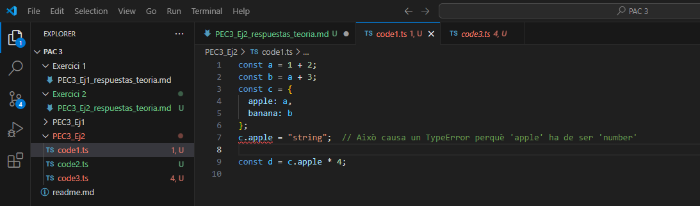

# PEC3_Ej2 - Respostes Teòriques

## Error TypeError a `code1.ts`

Aquesta línia vermella indica que TypeScript ha detectat un error de tipus. En aquest cas, intentem assignar una cadena (`string`) a `c.apple`, però `apple` ha estat inferit com a `number` per TypeScript. Això és un avantatge de TypeScript perquè detecta errors de tipus en temps de compilació, evitant possibles errors en temps d'execució.

## Qüestions

### 1. Tipus inferits en `code2.ts`

- `a`: `number`, ja que conté un valor numèric (`1042`).
- `b`: `string`, conté una cadena (`'apples and oranges'`).
- `c`: `string`, conté una cadena (`'pineapples'`).
- `d`: `boolean[]`, és un array amb valors `boolean`.
- `e`: `{ type: string }`, un objecte amb una propietat `type` de tipus `string`.
- `f`: `(number | boolean)[]`, és un array que conté un `number` i un `boolean`.
- `g`: `number[]`, és un array que conté un sol `number` (`3`).
- `h`: `null`, inicialitzat com a `null`.

### 2. Explicació dels errors en `code3.ts`

- `i: 3 = 3; i = 4;`: Error perquè `i` es defineix com un literal `3`, però intentem assignar-li un valor diferent (`4`).
- `j.push('5');`: Error perquè `j` és un array de `number`, però estem intentant afegir-hi un `string`.
- `k: never = 4;`: Error perquè `never` és un tipus que indica que la variable no pot tenir cap valor assignat, i aquí intentem assignar-li `4`.
- `m = l * 2;`: Error perquè `l` és de tipus `unknown`, i TypeScript no pot garantir que es pugui multiplicar per 2 sense saber el seu tipus exacte.

### 3. Diferència entre Classe i Interfície en TypeScript

- **Classe**: Proporciona una estructura per crear objectes, i pot tenir tant atributs com mètodes. A més, les classes poden ser instanciades (crear objectes concrets).
- **Interfície**: Defineix únicament l’estructura de l’objecte, com una plantilla de propietats i tipus, però no pot ser instanciada directament. S'utilitza per garantir que els objectes segueixin una estructura específica sense afegir comportament.
